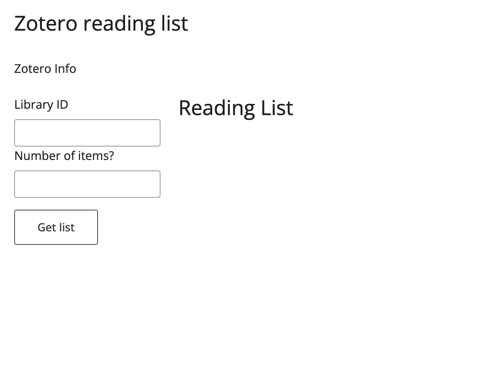
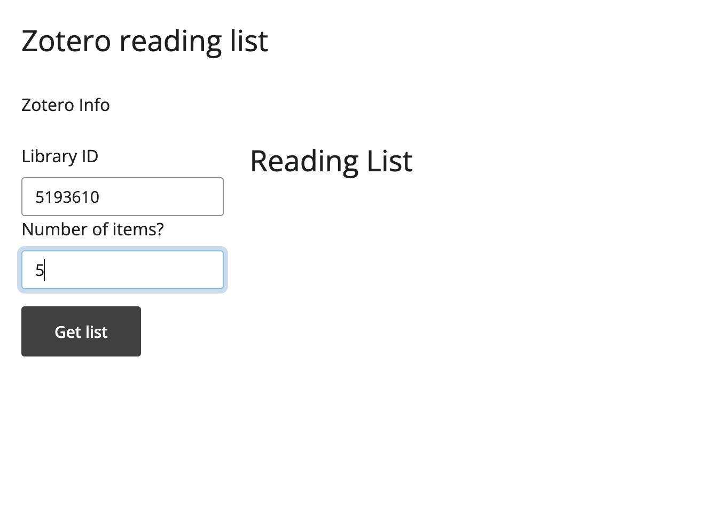
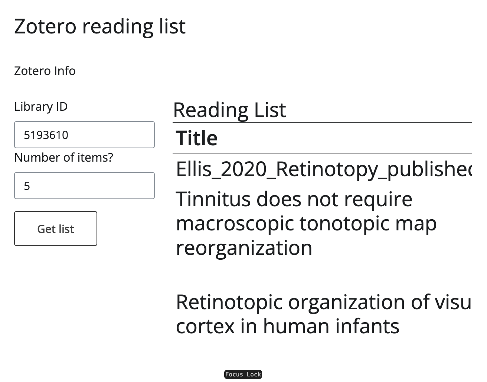

# readinglist
Welcome to `readinglist`! This is a very early view for a larger project to create a reminder reading list from recently added items to a Zotero account or specific library. If you're interested in scaling up this project, please reach out!!! Especially if you have web-dev experience.

# Intended usage (so far)
This is the empty UI.



You must first provide a **public**, and **open access membership** library ID. This is found in that library's URL. 

>[!NOTE]
>This can be found in the example URL: https://www.zotero.org/groups/**5193610**/my-library

Next you can specify how many of the most recent adds you want. 



It will give you the reading list as a scrollable data frame.



# Next steps

Ideally, this will become a tool that sends a reminder (email, SMS, etc.) to users about newly added items to their Zotero library at specified frequencies.

The user should be able to log into their Zotero account and choose from their personal library, or from a subset of libraries to receive notifications from. Users should be able to specify how often the want reminders and how many items to include in the reminder. 

# Testing the functionality locally
If you want to run this "app" locally, install [`pyzotero`](https://pyzotero.readthedocs.io/en/latest/) and [`shiny`](https://shiny.posit.co/py/) for Python. 

Clone this repo. 
```sh
git clone https://github.com/w-decker/readinglist.git
```

Open VSCODE and follow the demo on the Shiny website. 